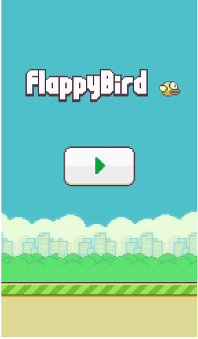
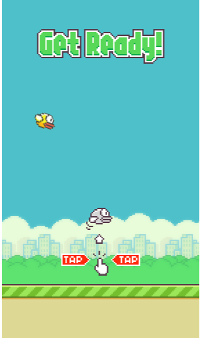
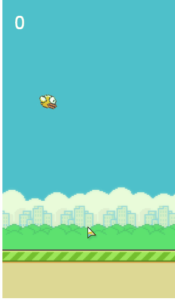

# flappy-bird
基于html5+phaser.js+node环境实现flappy-bird

## 1、环境依赖
js需要跑在服务器上，本项目是依赖于node 8.2.1环境，若是没有node环境，可提取关键代码文件，自己部署喜欢的服务器环境。

## 2、参照教程

-[How to Make Flappy Bird in HTML5 With Phaser](http://www.lessmilk.com/tutorial/flappy-bird-phaser-1)

-[用Phaser来制作一个html5游戏](http://www.cnblogs.com/2050/p/3790279.html)

本项目代码是根据上面两个教程做的，最开始用的第一个，仅有几十行代码就实现简单的flappy bird，后面觉的需要优化下，就参照了第二个教程，最后写出来的代码也就是两者的结合了

图片资源是网上搜索的，素材是相对完整的

## 3、框架

js主要框架是phaser.js

Phaser是一个简单易用且功能强大的html5游戏框架，利用它可以很轻松的开发出一个html5游戏。在这里就是用Phaser来制作Flappy Bird，支持的浏览器：IE9+、Firefox、Chrome、Opera、Safari以及移动端的能支持html5的浏览器，推荐使用谷歌浏览器，因为它性能最好。

phaser.js主要知识可在官方文档学习，这边我是在[phaser学习笔记](https://stonetingxin.gitbooks.io/phaser/content/introudce/README.html)学习的

## 4、关键文件

整个代码关键文件在于：public/images、public/javascript、views/index.ejs

其余的是node项目结构造成的，views/index.ejs就相当于index.html，若是不想用node，就将这几个关键文件提取出来自己重新部署喜欢的服务器，要注意的是index和main.js里面资源的路径也要跟着变化
